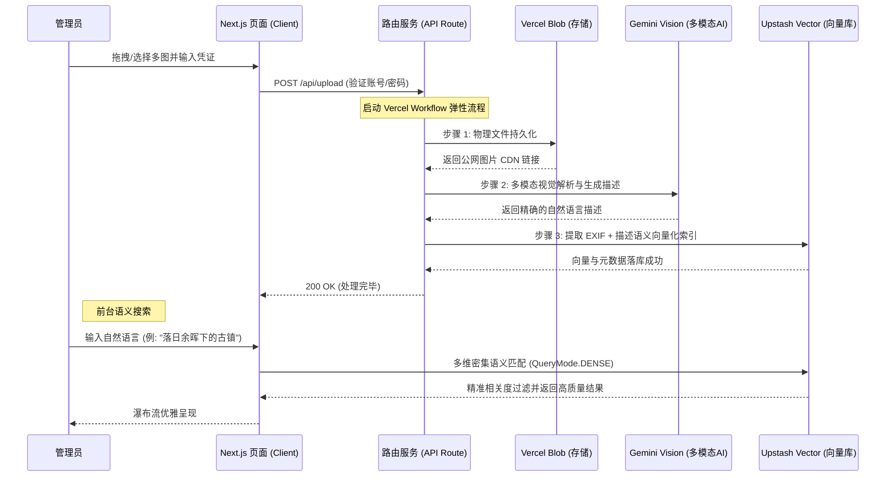

# ✨ Vectr AI Search

**Vectr AI Search** 是一款极速、优雅且低成本的**智能多模态语义图像检索中心**。系统通过 AI 多模态大模型自动分析上传图像，并将其转为包含丰富 EXIF 参数的高维密集向量，存储于云端实现毫秒级的自然语言图像检索。

---

## 🌟 核心亮点 (Key Features)

- 📤 **智能图库管理后台**：独立于前台的后台管理面板 `/admin`，集成了高品质大图审计、EXIF 提取展示、批量上传与数据一键销毁等功能。
- 🛡️ **双重账号密码认证**：升级为高度安全的 `ADMIN_USERNAME` + `ADMIN_PASSWORD` 双重登录防火墙，全站服务器端安全防护。
- 🤫 **双重隐蔽后台入口 (Easter Eggs)**：
  - **连击彩蛋**：连续快速点击左上角 Logo/标题 **5 次**即可启动秘密路由跳转。
  - **极客热键**：在页面任意位置敲击 **`Option + A`** (Mac) 或 **`Alt + A`** (Windows) 瞬间秒达后台。
- 🧠 **双模语义解析**：全面搭载 **Google Gemini 2.5 Flash** 顶级视觉大语言模型，完美实现图像内容的多语种深度理解与中文友好契合。
- 🔍 **密集多维向量检索**：基于 `@upstash/vector` 的 **DENSE 模式** (Cosine 相似度度量) 运算，精准设定绝对相关度阈值过滤，免去传统数据库的繁重开销。
- 🔄 **高弹性弹性架构**：集成 `Vercel Workflow` 自动断点续传与重试，配备 Vercel Blob 的“软删除”与破图防崩溃熔断机制。

---

## 🚀 业务流程与架构 (How It Works)

当您在管理后台上传图片时，系统会全自动处理以下步骤：



---

## 🛠️ 技术栈 (Tech Stack)

* **应用框架**：`Next.js 15 (Turbopack 极速模式)` + `React 19 (Server Components)`
* **工作流调度**：`Vercel Workflow` (提供指数级避退与断点自动恢复)
* **视觉大模型**：`Google Gemini 2.5 Flash` (由 Vercel AI SDK 强力驱动)
* **向量底座**：`Upstash Vector Search (Dense Mode & BGE-M3 多语言语义嵌入模型)`
* **文件存储**：`Vercel Blob Storage`
* **代码规范**：`Biome` 极致化校验与排版

---

## 💻 本地开发指南 (Local Development)

### 1. 克隆与安装
```bash
git clone https://github.com/vinono/vectr.git
cd vectr
pnpm install
```

### 2. 环境变量配置
在项目根目录创建 `.env.local` 配置文件：
```bash
# 存储层：Vercel Blob 密钥
BLOB_READ_WRITE_TOKEN="your-vercel-blob-token"

# 向量索引：Upstash 向量数据库配置
UPSTASH_SEARCH_REST_URL="https://your-index.upstash.io"
UPSTASH_SEARCH_REST_TOKEN="your-token"

# 安全管控：管理后台账号与密码
ADMIN_USERNAME="admin"
ADMIN_PASSWORD="your-strong-password"

# 多模态引擎：Google Gemini 密钥
GEMINI_API_KEY="your-gemini-api-key"
```

### 3. 运行与验证
```bash
# 启动开发服务器 (支持 Turbopack 瞬时热重载)
pnpm dev

# 运行全链路集成诊断测试 (Gemini 联通性与 Upstash 向量自动收发测试)
npx tsx test-integration.ts
```

---

## 📁 核心结构说明 (Project Structure)

```
vectr/
├── app/
│   ├── actions/
│   │   ├── admin.ts           # 管理员凭证核验与列表安全读取
│   │   ├── delete.ts          # 物理文件与向量数据级联软销毁
│   │   └── search.ts          # DENSE 相似度密集匹配搜索
│   ├── admin/
│   │   └── page.tsx           # 管理后台面板 (支持批量上传、独立注销、审计等)
│   ├── api/
│   │   └── upload/
│   │       ├── route.ts       # 弹性上传工作流接入路由
│   │       ├── upload-image.ts# 步骤 1 物理上传
│   │       ├── generate-description.ts # 步骤 2 视觉大模型生成
│   │       └── index-image.ts # 步骤 3 向量化自动归档
│   ├── layout.tsx
│   └── page.tsx               # 极致美学前台自然语言检索主页
├── components/
│   ├── header.tsx             # 包含连击彩蛋与热键挂载的导航侧边栏
│   ├── results.tsx            # 自动加载首屏图片与抗崩溃降级
│   └── results.client.tsx     # 丝滑卡片弹窗轮播与自然语言搜索端
```

---

## 🤝 贡献与反馈
欢迎提交 Pull Request 来与我们一同让 Vectr AI Search 变得更完美！

## 📜 许可证
[MIT](LICENSE)
